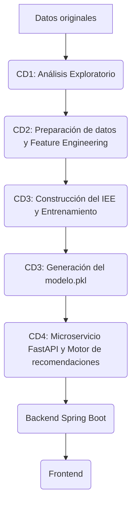

# 📊 EnergiAI – Módulo de Ciencia de Datos

### Inteligencia Artificial para el análisis y clasificación del consumo energético de hogares mediante Ciencia de Datos y Machine Learning.


---

## 2. Descripción del módulo

El módulo de Ciencia de Datos (`analisis_datos`) es el núcleo analítico y predictivo del proyecto **EnergiAI**. Su propósito es procesar, entender y modelar el comportamiento energético de los hogares para determinar su nivel de eficiencia.

*   **Objetivo general:** Construir y entrenar un modelo de Machine Learning capaz de evaluar el consumo de un hogar y clasificarlo según su eficiencia energética.
*   **Alcance:** Abarca desde la ingesta de datos crudos y su análisis exploratorio (EDA), pasando por la limpieza y la ingeniería de características (Feature Engineering) para llevar los datos a nivel de hogar, hasta el entrenamiento y exportación del modelo predictivo.
*   **Qué problema resuelve:** Permite a los usuarios comprender si su consumo es eficiente o ineficiente en relación con su contexto, ofreciendo un diagnóstico accionable.
*   **Integración con Backend:** El modelo final se integrará en un microservicio de IA. Este microservicio recibirá un JSON desde el Backend con las variables de la vivienda, ejecutará el modelo y devolverá la clasificación.

---

## 3. Objetivos

*   Analizar patrones de consumo energético mediante estadística descriptiva.
*   Preparar y transformar los datos para que la unidad de análisis sea el hogar.
*   Construir variables para Machine Learning alineadas con la API.
*   Construir el Índice de Eficiencia Energética (IEE).
*   Entrenar un modelo predictivo de clasificación.
*   Exportar un modelo reutilizable.
*   Integrarlo posteriormente mediante un microservicio de IA.

---

## 4. Tecnologías utilizadas

*   **Lenguaje:** Python 3.13
*   **Ciencia de Datos:** Pandas, NumPy, Scikit-Learn, Matplotlib
*   **Entorno:** Google Colab, Jupyter Notebook
*   **Control de versiones:** Git, GitHub

---

## 5. Estructura del proyecto

```text
analisis_datos/
│
├── README.md               # Documentación técnica oficial del módulo
│
├── data/                   # Contiene los datasets utilizados
│   ├── raw/                # Archivos originales. No deben modificarse.
│   └── processed/          # Datos procesados y agrupados
│
├── models/                 # Almacena el modelo final entrenado (modelo.pkl)
│
├── notebooks/              # Notebooks desarrollados por el equipo
│   ├── cd1/                # Análisis Exploratorio de Datos (EDA)
│   ├── cd2/                # Preparación de datos y Feature Engineering
│   ├── cd3/                # Modelado predictivo y construcción del IEE
│   └── cd4/                # Motor de recomendaciones e integración
│
└── reports/                # Documentación técnica generada en cada etapa

```

## 6. Descripción de los datasets

### Smart Home Energy Consumption (Dataset Principal)
*   **Descripción:** Datos simulados y recopilados de entornos de hogares inteligentes. Tras el procesamiento, cada registro representa un hogar único identificado por un `Home ID`.
*   **Variables principales:** `consumo_kwh`, `cantidad_personas`, `cantidad_equipos`, `temperatura_exterior`, `uso_horario_pico`.
*   **Variable objetivo:** Nivel de eficiencia (A construir a partir del IEE).
*   **Selección:** Fue seleccionado porque, tras su agrupación, representa exactamente la misma estructura de datos que recibirá el microservicio en producción.

### Household Power Consumption (Dataset de Apoyo)
*   **Descripción:** Repositorio de Machine Learning de UCI (Universidad de California, Irvine).
*   **Cantidad de registros:** Más de 2 millones de mediciones.
*   **Variables principales:** `Global_active_power`, `Voltage`, `Sub_metering_1, 2, 3`.
*   **Motivo de uso:** Se utiliza como dataset complementario para validar curvas de carga y realizar análisis profundo, no para el entrenamiento del modelo principal.

---

## 7. Flujo del proyecto



---

## 8. Flujo de trabajo del equipo

### CD1 (Científico de Datos 1)
*   **Análisis Exploratorio de Datos (EDA)**.
*   Hallazgos y conclusiones sobre los patrones de consumo.

### CD2 (Científico de Datos 2)
*   **Transformación de datos:** Agrupación del dataset para que cada fila represente un único hogar usando el `Home ID`.
*   **Cálculo de nuevas variables:** Suma del consumo total, conteo de cantidad de equipos, cálculo de temperatura promedio y evaluación porcentual del uso en horario pico.
*   **Partición Train/Test:** Generación de la nueva división (80/20) asegurando que no existan hogares repetidos entre conjuntos.
*   **Validaciones:** Verificación de tipos de datos, ausencia de nulos y consistencia de variables.

### CD3 (Científico de Datos 3) 🔄 *[En espera de datos de CD2]*
*(Esta sección se completará cuando CD3 entregue el modelo)*
*   Construcción del Índice de Eficiencia Energética (IEE).
*   Variables utilizadas para el entrenamiento.
*   Algoritmos evaluados y modelo seleccionado.
*   Métricas de desempeño.

### CD4 (Científico de Datos 4) ⏳ *[Pendiente]*
*(Esta sección se completará cuando CD4 finalice la integración)*
*   Desarrollo del microservicio IA y API.
*   Motor de recomendaciones.
*   Explicación de resultados del modelo.

---

## 9. Variables del sistema

La siguiente tabla define la correspondencia exacta para garantizar la coherencia entre el entrenamiento y la inferencia:

| Variable API | Variable Dataset Preparado | Descripción |
| :--- | :--- | :--- |
| `consumo_kwh` | `consumo_kwh` | Suma del consumo energético de todos los electrodomésticos del hogar. |
| `cantidad_personas` | `cantidad_personas` | Número de personas que habitan el hogar (conservado de Household Size). |
| `cantidad_equipos` | `cantidad_equipos` | Cantidad de tipos de electrodomésticos diferentes registrados en el hogar. |
| `temperatura_exterior` | `temperatura_exterior` | Promedio de la temperatura exterior para el hogar. |
| `uso_horario_pico` | `uso_horario_pico` | Valor booleano indicando si el porcentaje de uso en horario pico es >= 50%. |

---

## 10. Arquitectura del módulo de Ciencia de Datos


---

## 11. Estado del proyecto

| Etapa | Responsable | Estado |
| :--- | :--- | :--- |
| Análisis Exploratorio (EDA) | CD1 | ✅ Finalizado |
| Agrupación por Hogar y Variables | CD2 | 🔄 En desarrollo (Ajuste) |
| Construcción IEE y Modelado | CD3 | ⏳ Pendiente de CD2 |
| Microservicio y Recomendaciones | CD4 | ⏳ Pendiente |

---

## 12. Próximas etapas

Esta sección queda estructurada y preparada para incorporar los resultados a medida que avancen las siguientes fases del proyecto. No se inventará información; se actualizará cuando CD3 y CD4 liberen sus entregables.

### Resultados del Modelo (CD3)
*   **Construcción del IEE:** Fórmula y variables finales utilizadas.
*   **Resultados del modelo:** Algoritmo seleccionado.
*   **Métricas:** Accuracy, Precision, Recall y F1-Score.
*   **Matriz de confusión:** Evaluación sobre el conjunto de pruebas.
*   **Importancia de variables:** Gráfico de *Feature Importance*.

### Integración y Lógica de Negocio (CD4)
*   **Integración con FastAPI:** Explicación de los endpoints del microservicio.
*   **Recomendaciones generadas por el sistema:** Catálogo de acciones sugeridas según la clasificación de eficiencia del hogar.
