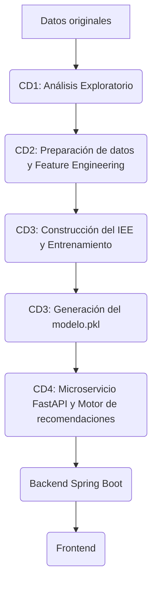
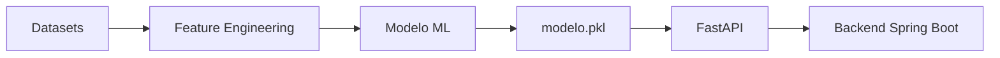

# 📊 EnergiAI – Módulo de Ciencia de Datos

### Inteligencia Artificial para el análisis y clasificación del consumo energético de hogares mediante Ciencia de Datos y Machine Learning.


---

## 2. Descripción del módulo

El módulo de Ciencia de Datos (`analisis_datos`) es el núcleo analítico y predictivo del proyecto **EnergiAI**. Su propósito es procesar, entender y modelar el comportamiento energético de los hogares para determinar su nivel de eficiencia.

*   **Objetivo general:** Construir y entrenar un modelo de Machine Learning capaz de evaluar el consumo de un hogar y clasificarlo según su eficiencia energética.
*   **Alcance:** Abarca desde la ingesta de datos crudos y su análisis exploratorio (EDA), pasando por la limpieza y la ingeniería de características (Feature Engineering) para llevar los datos a nivel de hogar, hasta el entrenamiento y exportación del modelo predictivo.
*   **Qué problema resuelve:** Permite a los usuarios comprender si su consumo es eficiente o ineficiente en relación con su contexto, ofreciendo un diagnóstico accionable.
*   **Integración con Backend:** El modelo final se integrará en un microservicio de IA. Este microservicio recibirá un JSON desde el Backend con las variables de la vivienda, ejecutará el modelo y devolverá la clasificación.

---

## 3. Objetivos

*   Analizar patrones de consumo energético mediante estadística descriptiva.
*   Preparar y transformar los datos para que la unidad de análisis sea el hogar.
*   Construir variables para Machine Learning alineadas con la API.
*   Construir el Índice de Eficiencia Energética (IEE).
*   Entrenar un modelo predictivo de clasificación.
*   Exportar un modelo reutilizable.
*   Integrarlo posteriormente mediante un microservicio de IA.

---

## 4. Tecnologías utilizadas

*   **Lenguaje:** Python 3.13
*   **Ciencia de Datos:** Pandas, NumPy, Scikit-Learn, Matplotlib
*   **Entorno:** Google Colab, Jupyter Notebook
*   **Control de versiones:** Git, GitHub

---

## 5. Estructura del proyecto

```text
analisis_datos/
│
├── README.md               # Documentación técnica oficial del módulo
│
├── data/                   # Contiene los datasets utilizados
│   ├── raw/                # Archivos originales. No deben modificarse.
│   └── processed/          # Datos procesados y agrupados
│
├── models/                 # Almacena el modelo final entrenado (modelo.pkl)
│
├── notebooks/              # Notebooks desarrollados por el equipo
│   ├── cd1/                # Análisis Exploratorio de Datos (EDA)
│   ├── cd2/                # Preparación de datos y Feature Engineering
│   ├── cd3/                # Modelado predictivo y construcción del IEE
│   └── cd4/                # Motor de recomendaciones e integración
│
└── reports/                # Documentación técnica generada en cada etapa

```

## 6. Descripción de los datasets

### Smart Home Energy Consumption (Dataset Principal)
*   **Descripción:** Datos simulados y recopilados de entornos de hogares inteligentes. Tras el procesamiento, cada registro representa un hogar único identificado por un `Home ID`.
*   **Variables principales:** `consumo_kwh`, `cantidad_personas`, `cantidad_equipos`, `temperatura_exterior`, `uso_horario_pico`.
*   **Variable objetivo:** Nivel de eficiencia (A construir a partir del IEE).
*   **Selección:** Fue seleccionado porque, tras su agrupación, representa exactamente la misma estructura de datos que recibirá el microservicio en producción.

### Household Power Consumption (Dataset de Apoyo)
*   **Descripción:** Repositorio de Machine Learning de UCI (Universidad de California, Irvine).
*   **Cantidad de registros:** Más de 2 millones de mediciones.
*   **Variables principales:** `Global_active_power`, `Voltage`, `Sub_metering_1, 2, 3`.
*   **Motivo de uso:** Se utiliza como dataset complementario para validar curvas de carga y realizar análisis profundo, no para el entrenamiento del modelo principal.

---

## 7. Flujo del proyecto



---

## 8. Flujo de trabajo del equipo

### CD1 (Científico de Datos 1)
*   **Análisis Exploratorio de Datos (EDA)**.
*   Hallazgos y conclusiones sobre los patrones de consumo.

### Selección y Justificación del Dataset (CD1)
Al inicio del proyecto, durante la fase de exploración y comprensión de los datos, se recibieron dos conjuntos de datos distintos para su evaluación. 

Tras un análisis preliminar, el equipo tomó la decisión estratégica de avanzar trabajando exclusivamente con el dataset enfocado en hogares inteligentes (**Smart Home**). 

**Justificación de la decisión:**
* **Alineación con el objetivo:** Este conjunto de datos refleja de manera más clara y directa el problema que busca resolver la API: la clasificación de eficiencia energética por hogar.
* **Calidad de variables:** Contiene la estructura óptima (consumo por horas, cantidad de equipos, clima, etc.) para aplicar las transformaciones necesarias y alimentar de forma correcta tanto al modelo predictivo (CD3) como a las reglas de negocio (CD4).

### Selección y Justificación del Dataset (CD1)
Al inicio del proyecto, durante la fase de exploración y comprensión de los datos, se recibieron dos conjuntos de datos distintos para su evaluación. 

Tras un análisis preliminar, el equipo tomó la decisión estratégica de avanzar trabajando exclusivamente con el dataset enfocado en hogares inteligentes (**Smart Home**). 

**Justificación de la decisión:**
* **Alineación con el objetivo:** Este conjunto de datos refleja de manera más clara y directa el problema que busca resolver la API: la clasificación de eficiencia energética por hogar.
* **Calidad de variables:** Contiene la estructura óptima (consumo por horas, cantidad de equipos, clima, etc.) para aplicar las transformaciones necesarias y alimentar de forma correcta tanto al modelo predictivo (CD3) como a las reglas de negocio (CD4).

### CD2 (Científico de Datos 2)
*   **Transformación de datos:** Agrupación del dataset para que cada fila represente un único hogar usando el `Home ID`.
*   **Cálculo de nuevas variables:** Suma del consumo total, conteo de cantidad de equipos, cálculo de temperatura promedio y evaluación porcentual del uso en horario pico.
*   **Partición Train/Test:** Generación de la nueva división (80/20) asegurando que no existan hogares repetidos entre conjuntos.
*   **Validaciones:** Verificación de tipos de datos, ausencia de nulos y consistencia de variables.

### CD3 (Científico de Datos 3) 🔄 *[En desarrollo]*
*   **Construcción metodológica del IEE:** Selección de variables clave para el índice (`consumo_kwh`, `cantidad_equipos`, `temperatura_exterior`, `uso_horario_pico`).
*   **Normalización y Ponderación:** Aplicación de técnicas de escalado (ej. Min-Max o StandardScaler) y asignación de pesos técnicos para cada variable.
*   **Definición de categorías:** Cálculo del índice en una escala de 0 a 100 y creación de las etiquetas objetivo (Eficiente, Moderado, Ineficiente) basadas en la distribución real de los datos.
*   **Entrenamiento y Evaluación:** Uso exclusivo de `smart_home_train.csv` para entrenar y `smart_home_test.csv` para evaluar y comparar distintos algoritmos de clasificación.
*   **Generación de Entregables:** Creación del notebook de modelado (`modelado.ipynb`), archivo de métricas (`metricas_modelos.csv`), modelo exportado (`modelo.pkl`) y el reporte metodológico oficial (`reporte_cd3.pdf`).

### Despliegue e Integración de la API (CD4) ✅ *[Completado]*
En esta etapa final, se desarrolló el microservicio encargado de exponer el modelo de Machine Learning y aplicar las reglas de negocio, estableciendo el contrato de integración oficial (Versión 2.0).

* **Tecnología:** Microservicio desarrollado en FastAPI.
* **Comunicación:** Integración mediante el endpoint `POST /analisis-energetico` para ser consumido por el Backend en Java Spring Boot.
* **Reglas de Negocio:** El microservicio procesa la predicción del modelo y aplica lógica adicional para calcular el costo estimado mensual, el ahorro potencial (mensual y anual), y devolver una lista de recomendaciones accionables.

#### Decisiones Arquitectónicas Clave
1. **Desacople de Inferencia (Eliminación del IEE):** Se eliminó el campo IEE de la respuesta de la API, ya que el modelo en producción (`predict()` y `predict_proba()`) solo genera la categoría y su nivel de confianza. Esto permite actualizar el modelo a futuro sin romper el contrato con el Backend.
2. **Alta Disponibilidad (Estabilidad vs. LLM):** Se decidió retirar la integración en tiempo real con modelos LLM para la generación de "explicaciones" dinámicas. En su lugar, el sistema prioriza la fiabilidad devolviendo un arreglo de "recomendaciones" estáticas predefinidas, eliminando así los puntos de falla por latencia o caída de servicios de terceros.

#### Contrato de Respuesta Exitosa (JSON)
El formato final de salida que recibe el cliente es el siguiente:

```json
{
    "categoria": "Moderado",
    "probabilidad": 0.99,
    "costo_estimado_mensual": 315.00,
    "ahorro_potencial_mensual": 31.50,
    "ahorro_potencial_anual": 378.00,
    "recomendaciones": [
        "Reducir el consumo durante los horarios pico.",
        "Revisar los equipos con mayor consumo energético.",
        "Optimizar el uso de electrodomésticos."
    ]
}
```


---

## 9. Variables del sistema

La siguiente tabla define la correspondencia exacta para garantizar la coherencia entre el entrenamiento y la inferencia:

| Variable API | Variable Dataset Preparado | Descripción |
| :--- | :--- | :--- |
| `consumo_kwh` | `consumo_kwh` | Suma del consumo energético de todos los electrodomésticos del hogar. |
| `cantidad_personas` | `cantidad_personas` | Número de personas que habitan el hogar (conservado de Household Size). |
| `cantidad_equipos` | `cantidad_equipos` | Cantidad de tipos de electrodomésticos diferentes registrados en el hogar. |
| `temperatura_exterior` | `temperatura_exterior` | Promedio de la temperatura exterior para el hogar. |
| `uso_horario_pico` | `uso_horario_pico` | Valor booleano indicando si el porcentaje de uso en horario pico es >= 50%. |

---

## 10. Arquitectura del módulo de Ciencia de Datos




---

## 11. Estado del proyecto

| Etapa | Responsable | Estado |
| :--- | :--- | :--- |
| Análisis Exploratorio (EDA) | CD1 | ✅ Finalizado |
| Agrupación por Hogar y Variables | CD2 | ✅ Finalizado |
| Construcción IEE y Modelado | CD3 | ✅ Finalizado |
| Microservicio y Recomendaciones | CD4 | ✅ Finalizado |

---
