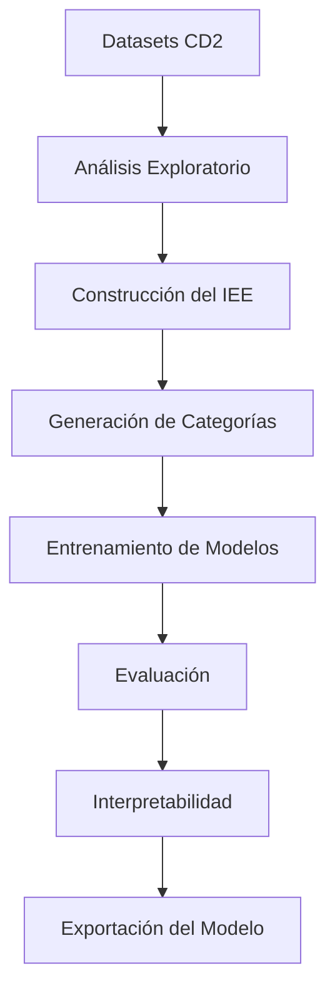
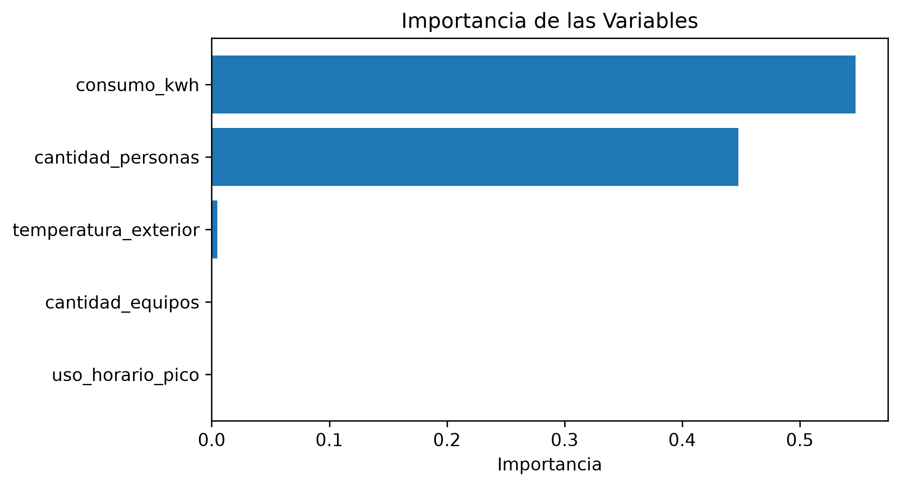

# 📊 Reporte Técnico – CD3

## Modelado Predictivo para la Clasificación de la Eficiencia Energética de Hogares

**Proyecto:** EnergiAI – Inteligencia para el Consumo Energético

**Hackathon:** ONE G9 – Alura Latam & Oracle Next Education

**Rol:** Científico de Datos 3 (CD3)

**Integrante:** Juan Esteban Rodríguez Aranda

**Fecha:** Agosto de 2026

---

# Introducción

El presente componente corresponde al desarrollo del modelo de Machine Learning
del proyecto **EnergiAI**, cuyo objetivo es clasificar el nivel de eficiencia
energética de un hogar a partir de un conjunto reducido de variables de entrada.

Durante esta etapa se construyó un **Índice de Eficiencia Energética (IEE)**,
el cual permitió generar la variable objetivo utilizada para entrenar modelos
supervisados de clasificación.

Posteriormente se evaluaron tres algoritmos de Machine Learning y se seleccionó
el modelo con mejor desempeño para su integración con la API del proyecto.

---

# Metodología

El proceso desarrollado se estructuró en siete etapas consecutivas.

Las actividades desarrolladas fueron:

- Exploración del conjunto de datos.
- Construcción del Índice de Eficiencia Energética.
- Generación de la variable objetivo.
- Entrenamiento de modelos.
- Comparación mediante métricas de clasificación.
- Interpretabilidad del modelo.
- Exportación del modelo final.

---

# Construcción del Índice de Eficiencia Energética

El conjunto de datos original no contenía una variable que representara el nivel
de eficiencia energética del hogar.

Después del análisis exploratorio se identificó que únicamente dos variables
aportaban información significativa para construir el índice:

- **consumo_kwh**
- **cantidad_personas**

Las variables **temperatura_exterior**, **cantidad_equipos** y
**uso_horario_pico** no fueron utilizadas para el cálculo del índice debido a su
baja capacidad discriminativa, aunque se conservaron como variables de entrada
para mantener la compatibilidad con la API.

El índice se construyó utilizando:

- Eficiencia por consumo absoluto.
- Eficiencia por consumo por habitante.

Ambos indicadores fueron normalizados mediante Min-Max y posteriormente
invertidos para que menores consumos representaran mayores niveles de
eficiencia.

Finalmente, el IEE se calculó como el promedio simple de ambos indicadores,
obteniendo una escala entre **0 y 100**.

---

# Entrenamiento y Evaluación

Se entrenaron tres algoritmos de clasificación:

- Decision Tree
- Random Forest
- Gradient Boosting

## Resultados

| Modelo | Accuracy | Precision | Recall | F1 |
|:-------|:--------:|:---------:|:------:|:--:|
| Decision Tree | 0.96 | 0.96 | 0.96 | 0.96 |
| Random Forest | 0.98 | 0.98 | 0.98 | 0.98 |
| **Gradient Boosting** | **0.99** | **0.99** | **0.99** | **0.99** |

Gradient Boosting presentó el mejor desempeño y fue seleccionado como modelo
final del proyecto.

---

# Interpretabilidad

El análisis de importancia de variables mostró que el modelo concentra
prácticamente toda su capacidad predictiva en dos atributos:

- **consumo_kwh**
- **cantidad_personas**

Las variables restantes presentaron una contribución mínima o nula durante la
clasificación.

    

Estos resultados validan las decisiones tomadas durante la construcción del
Índice de Eficiencia Energética.

---

# Conclusiones

- Se diseñó un Índice de Eficiencia Energética (IEE) con una escala entre 0 y
  100.

- El proceso permitió generar una variable objetivo interpretable para el
  entrenamiento de modelos supervisados.

- Gradient Boosting obtuvo el mejor desempeño, alcanzando una exactitud cercana
  al **99 %**.

- El modelo fue exportado en formato **.pkl** para su integración con la API de
  EnergiAI.

---

# Recomendaciones

- Mantener la estructura de variables utilizada durante el entrenamiento.

- Incrementar el volumen de datos utilizando registros reales.

- Monitorear el desempeño del modelo conforme aumente la cantidad de datos.

- Conservar las variables actualmente poco representativas para futuras
  versiones del modelo.
